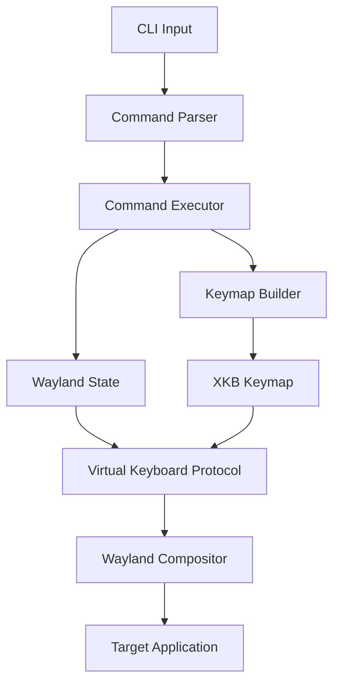

# Architecture Overview

wrtype is designed as a modular, well-structured Rust application that implements the Wayland virtual keyboard protocol. This document provides a comprehensive overview of the system architecture, design decisions, and implementation details.

## High-Level Architecture



wrtype follows a pipeline architecture where data flows from command-line input through various processing stages to ultimately generate Wayland keyboard events.

## Core Components

### 1. Main Module (`main.rs`)

**Responsibilities:**
- Command-line argument parsing using `clap`
- Input validation and preprocessing
- Command sequence generation
- Application lifecycle management

**Key Types:**
- `Args` - Structured CLI arguments
- `Command` - Internal command representation
- `Modifier` - Keyboard modifier enumeration

```rust
pub enum Command {
    Text { text: String, delay: Duration },
    ModPress(Modifier),
    ModRelease(Modifier),
    KeyPress(String),
    KeyRelease(String),
    Sleep(Duration),
    StdinText { delay: Duration },
}
```

### 2. Wayland Protocol Layer (`wayland.rs`)

**Responsibilities:**
- Wayland connection management
- Protocol object lifecycle
- Virtual keyboard protocol implementation
- Event dispatching and handling

**Key Components:**
- `WaylandState` - Central protocol state
- Protocol bindings generated from XML
- Event handlers for registry discovery
- Connection and roundtrip management

```rust
pub struct WaylandState {
    seat: Option<wl_seat::WlSeat>,
    manager: Option<ZwpVirtualKeyboardManagerV1>,
    keyboard: Option<ZwpVirtualKeyboardV1>,
    pub mod_state: u32,
}
```

### 3. Keymap Management (`keymap.rs`)

**Responsibilities:**
- Dynamic XKB keymap generation
- Unicode character to keysym mapping
- Keycode allocation and caching
- XKB file format generation

**Key Features:**
- On-demand keymap expansion
- Efficient character lookup caching
- XKB standard compliance
- Special character handling (newline, tab, escape)

```rust
pub struct KeymapBuilder {
    entries: Vec<KeymapEntry>,
    char_to_keycode: HashMap<char, u32>,
    symbol_to_keycode: HashMap<xkb::Keysym, u32>,
}
```

### 4. Command Execution Engine (`executor.rs`)

**Responsibilities:**
- Sequential command execution
- Protocol synchronization
- Timing control and delays
- UTF-8 stdin processing

**Execution Flow:**
1. Initialize keymap and upload to compositor
2. Process commands sequentially
3. Handle keymap updates dynamically
4. Manage modifier state
5. Clean up on completion

## Data Flow

### 1. Input Processing

```
Command Line → Args Parser → Command Generator → Command Queue
```

- CLI arguments are parsed using `clap` derive macros
- Arguments are converted to internal `Command` representations
- Commands are ordered for consistent execution

### 2. Wayland Connection

```
Environment → Connection → Registry → Protocol Discovery → Object Binding
```

- Connect to Wayland display (usually via `WAYLAND_DISPLAY`)
- Discover available protocols through registry
- Bind to required protocols (seat, virtual keyboard manager)
- Create virtual keyboard instance

### 3. Keymap Generation

```
Character/Key → XKB Lookup → Keycode Assignment → Keymap Generation → Upload
```

- Characters converted to XKB keysyms
- Keycodes allocated sequentially
- Complete XKB keymap generated in text format
- Keymap uploaded to compositor via file descriptor

### 4. Event Generation

```
Command → Keycode Resolution → Protocol Event → Compositor → Target App
```

- Commands resolved to specific keycodes
- Wayland keyboard events generated
- Events sent to compositor
- Compositor routes to focused application

## Key Design Decisions

### 1. Dynamic Keymap Generation

**Decision:** Generate keymaps on-demand rather than using static keymaps.

**Rationale:**
- Supports arbitrary Unicode characters
- Minimizes memory usage for simple use cases
- Provides flexibility for international text
- Avoids pre-defining large character sets

**Trade-offs:**
- Slight overhead for new characters
- Keymap regeneration on updates
- More complex implementation

### 2. Protocol-First Design

**Decision:** Implement Wayland virtual keyboard protocol directly rather than using higher-level libraries.

**Rationale:**
- Full control over protocol interaction
- Minimal dependencies and overhead
- Better error handling and debugging
- Educational value for protocol understanding

**Trade-offs:**
- More complex implementation
- Need to handle protocol edge cases
- Requires Wayland-specific knowledge

### 3. Synchronous Execution Model

**Decision:** Execute commands synchronously with explicit timing control.

**Rationale:**
- Predictable execution order
- Simple mental model for users
- Easy timing control with sleep commands
- Deterministic behavior for automation

**Trade-offs:**
- No parallelism for multiple operations
- Blocking on slow operations
- Less efficient for bulk operations

### 4. UTF-8 First Approach

**Decision:** Handle UTF-8 throughout the pipeline with proper boundary detection.

**Rationale:**
- International text support is essential
- Proper handling of multi-byte sequences
- Robust stdin processing
- Unicode-first design philosophy

**Trade-offs:**
- More complex string processing
- Additional validation overhead
- Handling of invalid sequences

## Protocol Implementation

### Virtual Keyboard Protocol Flow

1. **Discovery Phase:**
   ```
   Client → Registry → Seat Discovery
   Client → Registry → Virtual Keyboard Manager Discovery
   ```

2. **Initialization Phase:**
   ```
   Client → Manager → Create Virtual Keyboard
   Client → Keyboard → Upload Keymap
   ```

3. **Operation Phase:**
   ```
   Client → Keyboard → Set Modifiers
   Client → Keyboard → Key Press/Release Events
   ```

4. **Cleanup Phase:**
   ```
   Client → Keyboard → Release All Modifiers
   Client → Objects → Destroy/Cleanup
   ```

### Keymap Format

wrtype generates XKB keymaps in the standard text format:

```xkb
xkb_keymap {
    xkb_keycodes "(unnamed)" {
        minimum = 8;
        maximum = 16;
        <K1> = 9;
        <K2> = 10;
    };
    xkb_types "(unnamed)" { include "complete" };
    xkb_compatibility "(unnamed)" { include "complete" };
    xkb_symbols "(unnamed)" {
        key <K1> {[Return]};
        key <K2> {[space]};
    };
};
```

## Error Handling Strategy

### Layered Error Handling

1. **System Level:** Connection failures, protocol errors
2. **Application Level:** Invalid arguments, missing resources
3. **User Level:** Clear error messages with actionable advice

### Error Types

- **Protocol Errors:** Wayland connection, virtual keyboard not supported
- **Validation Errors:** Invalid key names, unknown modifiers
- **I/O Errors:** Stdin reading, file operations
- **Timing Errors:** Sleep interruption, timing precision

### Recovery Strategies

- **Graceful Degradation:** Continue processing where possible
- **Clean Cleanup:** Release modifiers and resources on exit
- **Clear Messaging:** Provide actionable error information

## Performance Characteristics

### Time Complexity
- **Keymap Lookup:** O(1) average for cached characters
- **Keymap Generation:** O(n) where n is number of unique characters
- **Command Processing:** O(m) where m is number of commands

### Space Complexity
- **Memory Usage:** O(k) where k is unique characters/keys used
- **Protocol Overhead:** Minimal per-event overhead
- **Keymap Size:** Grows linearly with character set

### Optimization Opportunities

1. **Keymap Batching:** Group character additions to reduce uploads
2. **Event Batching:** Combine multiple events in single roundtrip
3. **Caching:** Cache keymap generation results
4. **Streaming:** Process large stdin inputs in chunks

## Security Considerations

### Input Validation
- Validate all user inputs before processing
- Sanitize key names and modifier names
- Prevent injection attacks through careful parsing

### Protocol Security
- Use only documented Wayland protocols
- Validate all protocol responses
- Handle malformed compositor responses gracefully

### System Integration
- Respect compositor security policies
- Handle permission denials gracefully
- Avoid privilege escalation attempts

## Testing Strategy

### Unit Testing
- Individual component testing
- Mock Wayland protocols for testing
- Edge case validation

### Integration Testing
- Full pipeline testing
- Real protocol interaction
- Multi-compositor compatibility

### Property Testing
- Unicode character handling
- Timing precision validation
- Protocol state consistency

## Future Extensibility

### Planned Features
- Configuration file support
- Macro recording and playback
- Script execution capabilities
- GUI automation helpers

### Architecture Flexibility
- Plugin system for custom commands
- Multiple output formats (beyond Wayland)
- Advanced timing models
- Performance optimization hooks

This architecture provides a solid foundation for reliable, efficient, and extensible virtual keyboard functionality while maintaining simplicity and clarity in the codebase.