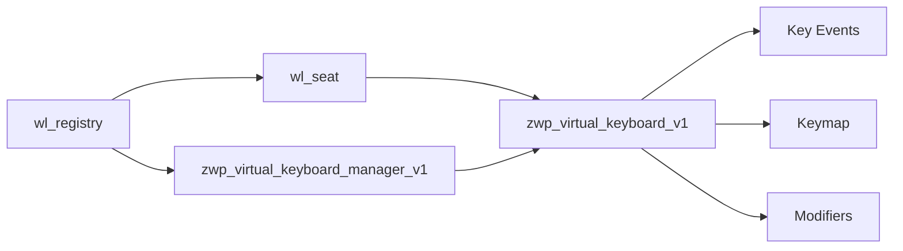

# Wayland Protocol Implementation

This document details how wrtype implements the Wayland virtual keyboard protocol and interacts with Wayland compositors.

## Protocol Overview

wrtype uses the `zwp_virtual_keyboard_unstable_v1` protocol extension to create virtual keyboards that can send input events to Wayland compositors.

### Protocol Objects



## Connection Establishment

### 1. Display Connection

```rust
let conn = Connection::connect_to_env()
    .context("Failed to connect to Wayland display")?;
```

wrtype connects to the Wayland display server using the `WAYLAND_DISPLAY` environment variable (typically `wayland-0` or `wayland-1`).

### 2. Registry Discovery

```rust
let registry = display.get_registry(&qh, ());
event_queue.roundtrip(&mut state)?;
```

The registry announces all available global objects (protocols). wrtype listens for:
- `wl_seat` - Input device collection
- `zwp_virtual_keyboard_manager_v1` - Virtual keyboard factory

### 3. Object Binding

```rust
// Bind to seat (input device collection)
let seat = registry.bind::<wl_seat::WlSeat, _, _>(
    name, 
    std::cmp::min(version, 7), 
    qh, 
    ()
);

// Bind to virtual keyboard manager
let manager = registry.bind::<ZwpVirtualKeyboardManagerV1, _, _>(
    name, 
    1, 
    qh, 
    ()
);
```

## Virtual Keyboard Creation

### Manager Interface

The virtual keyboard manager creates virtual keyboard instances:

```rust
let keyboard = manager.create_virtual_keyboard(seat, &qh, ());
```

This creates a `zwp_virtual_keyboard_v1` object associated with the specified seat.

### Keymap Upload

Before sending any key events, a keymap must be uploaded:

```rust
keyboard.keymap(
    wl_keyboard::KeymapFormat::XkbV1.into(),
    owned_fd.as_fd(),
    keymap_data.len() as u32 + 1,
);
```

The keymap is sent as:
- **Format**: XKB version 1 (the standard format)
- **File Descriptor**: Contains the complete keymap data
- **Size**: Length of keymap data including null terminator

## Event Generation

### Key Events

```rust
// Press key
keyboard.key(0, keycode, wl_keyboard::KeyState::Pressed.into());

// Release key  
keyboard.key(0, keycode, wl_keyboard::KeyState::Released.into());
```

Key events include:
- **Serial**: Always 0 for virtual keyboards
- **Keycode**: Linux keycode (XKB keycode + 8)
- **State**: Pressed or Released

### Modifier Events

```rust
keyboard.modifiers(depressed, 0, locked, 0);
```

Modifier events specify:
- **Depressed**: Currently held modifiers (Ctrl, Alt, Shift, etc.)
- **Latched**: One-shot modifiers (not used by wrtype)
- **Locked**: Toggle modifiers (Caps Lock, Num Lock)
- **Group**: Layout group (not used by wrtype)

### Protocol Synchronization

```rust
self.connection.roundtrip().context("Failed to roundtrip")?;
```

After each operation, wrtype performs a roundtrip to ensure the compositor has processed the events before continuing.

## Keymap Format

### XKB Structure

wrtype generates XKB keymaps with four main sections:

```xkb
xkb_keymap {
    xkb_keycodes "(unnamed)" { /* keycode definitions */ };
    xkb_types "(unnamed)" { include "complete" };
    xkb_compatibility "(unnamed)" { include "complete" };
    xkb_symbols "(unnamed)" { /* symbol mappings */ };
};
```

### Keycode Section

Maps symbolic names to numeric keycodes:

```xkb
xkb_keycodes "(unnamed)" {
    minimum = 8;           // Linux keycode offset
    maximum = 16;          // Dynamic based on characters used
    <K1> = 9;             // First key -> Linux keycode 9
    <K2> = 10;            // Second key -> Linux keycode 10
};
```

### Symbols Section

Maps keycodes to keysyms:

```xkb
xkb_symbols "(unnamed)" {
    key <K1> {[Return]};   // K1 produces Return keysym
    key <K2> {[space]};    // K2 produces space keysym  
    key <K3> {[a]};        // K3 produces 'a' keysym
};
```

### Dynamic Generation

wrtype builds keymaps dynamically:

1. **Character Input**: Convert Unicode → XKB keysym → keycode
2. **Named Keys**: Look up XKB keysym by name → keycode
3. **Keymap Generation**: Create complete XKB keymap text
4. **Upload**: Send keymap to compositor via file descriptor

## Protocol State Management

### Connection State

```rust
pub struct WaylandState {
    seat: Option<wl_seat::WlSeat>,
    manager: Option<ZwpVirtualKeyboardManagerV1>,
    keyboard: Option<ZwpVirtualKeyboardV1>,
    pub mod_state: u32,
}
```

wrtype maintains:
- **seat**: Input device collection
- **manager**: Virtual keyboard factory
- **keyboard**: Active virtual keyboard instance
- **mod_state**: Current modifier state bitmask

### Event Handlers

wrtype implements event handlers for protocol objects:

```rust
impl Dispatch<wl_registry::WlRegistry, ()> for WaylandState {
    fn event(/* registry global announcements */) { }
}

impl Dispatch<ZwpVirtualKeyboardV1, ()> for WaylandState {
    fn event(/* virtual keyboard events */) { }
}
```

Most virtual keyboard protocols are one-way (client → compositor), so event handlers are typically empty.

## Error Handling

### Connection Errors

```rust
// No Wayland display available
Connection::connect_to_env() 
    → Err("Failed to connect to Wayland display")

// Compositor doesn't support virtual keyboard
registry discovery 
    → manager.is_none() 
    → "Compositor does not support the virtual keyboard protocol"
```

### Protocol Errors

```rust
// Invalid keymap format
keyboard.keymap(invalid_format, fd, size)
    → Compositor may disconnect or ignore

// Invalid keycodes
keyboard.key(serial, invalid_keycode, state)
    → Compositor may ignore or disconnect
```

### Recovery Strategies

- **Graceful Degradation**: Continue where possible
- **Clear Error Messages**: Provide actionable feedback
- **Resource Cleanup**: Release objects on failure
- **State Reset**: Clear modifiers on exit

## Compositor Compatibility

### Supported Compositors

| Compositor | Status | Notes |
|------------|--------|--------|
| **Sway** | ✅ Full | Reference implementation |
| **Hyprland** | ✅ Full | Excellent compatibility |
| **GNOME** | ✅ Full | Works with Mutter |
| **KDE** | ✅ Full | Works with KWin |
| **Weston** | ✅ Full | Reference compositor |
| **River** | ✅ Full | Minimal, compliant |

### Protocol Variations

Different compositors may have subtle differences:

- **Security Policies**: Some compositors restrict virtual keyboards
- **Event Timing**: Timing sensitivity varies
- **Keymap Validation**: Strictness of XKB validation differs
- **Resource Limits**: Maximum keymap size, event rate limits

### Compatibility Testing

```bash
# Check if virtual keyboard protocol is available
wayland-info | grep virtual_keyboard

# Test basic functionality
wrtype "test"

# Test with different compositors
sway -c test-config
WAYLAND_DISPLAY=wayland-test wrtype "compositor test"
```

## Performance Considerations

### Protocol Overhead

Each operation requires a roundtrip:
- **Keymap Upload**: ~1ms (depends on keymap size)
- **Key Events**: ~0.1ms per event
- **Modifier Updates**: ~0.1ms per update

### Optimization Strategies

1. **Batch Operations**: Group related events
2. **Minimal Roundtrips**: Only sync when necessary
3. **Keymap Caching**: Reuse keymaps when possible
4. **Event Coalescing**: Combine rapid events

### Memory Usage

- **Connection Objects**: ~1KB baseline
- **Keymap Storage**: ~100 bytes per unique character
- **Protocol Buffers**: ~4KB for message queues

## Security Implications

### Privilege Requirements

Virtual keyboards typically require:
- **Wayland Connection**: User session access
- **Protocol Support**: Compositor must allow virtual keyboards
- **No Special Privileges**: Runs as normal user

### Security Boundaries

- **Input Isolation**: Can only send to focused applications
- **Permission Model**: Compositor controls access
- **No System Access**: Cannot bypass security policies

### Best Practices

- **Validate Input**: Check all user-provided data
- **Handle Errors**: Graceful failure on security denials
- **Minimal Scope**: Only request necessary capabilities
- **Audit Trail**: Log security-relevant operations

This protocol implementation provides a robust foundation for virtual keyboard functionality while maintaining compatibility across different Wayland compositors and handling edge cases gracefully.